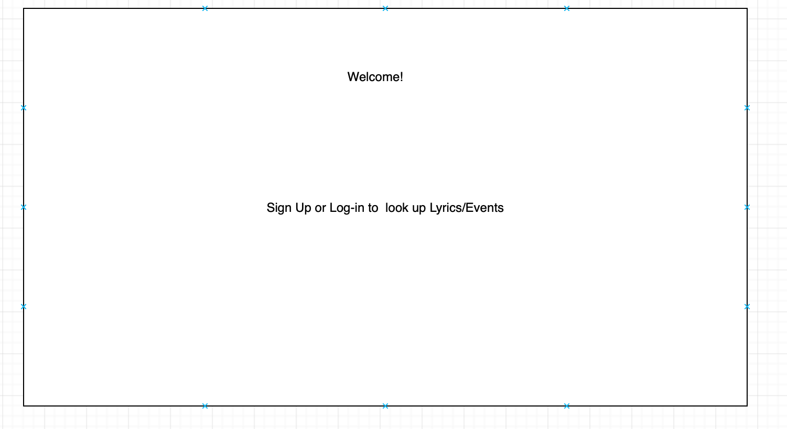
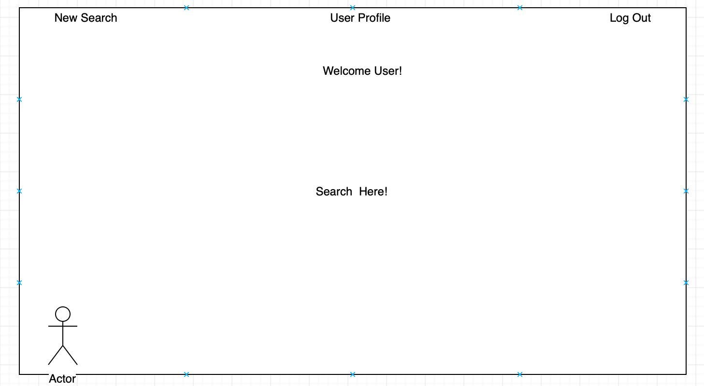
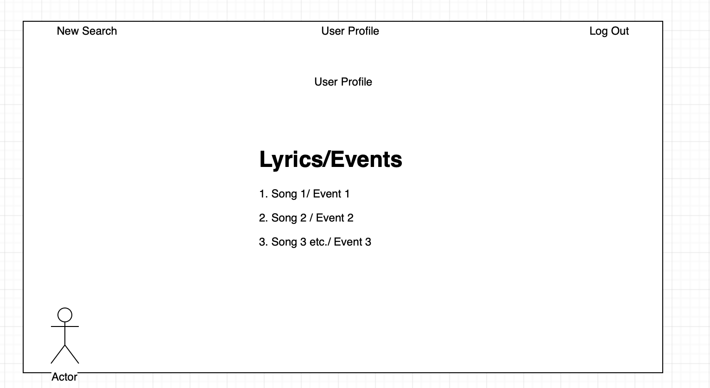
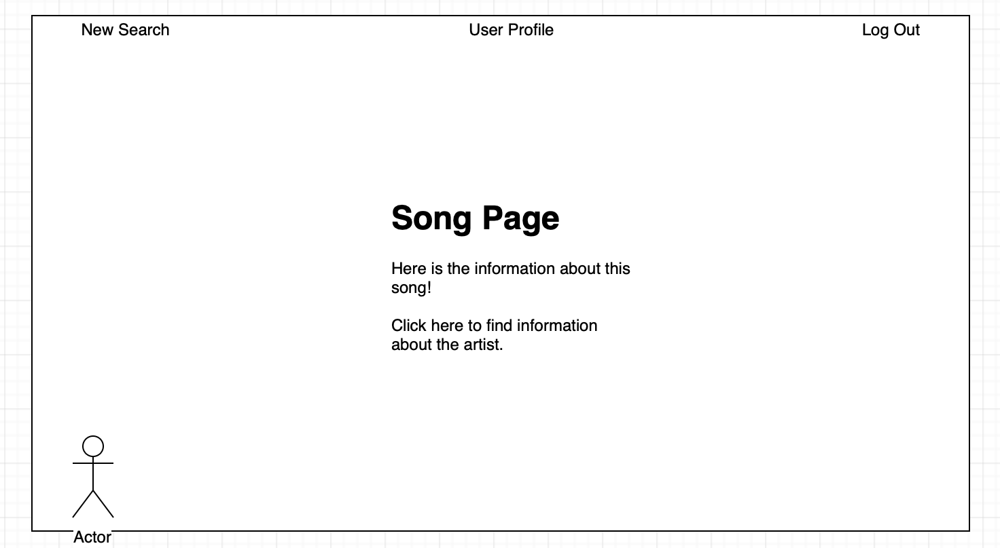
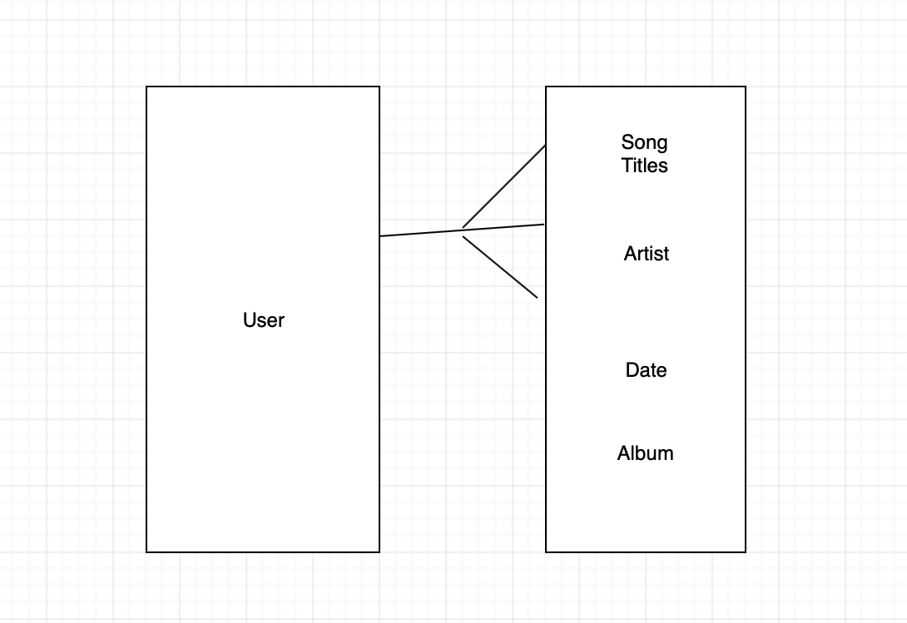
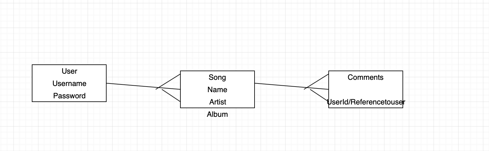

# projecttwo

## Lyrical Fun/ Events

### Option 1: Search a String to find out details of the song and artist who's lyrics match the song. 
### Option 2: Search by location to find Events near you.

##### The premise of both of these is to create a history and save events in a form to the users profile. 

###### Steps

1. Each will start with a login for a new user and then a sign in.

2. Once you are logged in, there is an announcement at the top of the page for you user.

3. There will be an index page that you can edit and delete as well as click on to render a shown page of each either lyric and event that will give you a description of each item. 

4. The opening page will be a search bar that utilizes the API which will be a new page, and after you search you will redirect to a show page.

5. There will be logout links on the top of the page.

6. There will be a user profile link at the top of the page

7. The user profile should have all past searches (link to an index page).

Models - Song Information which involves the title name and the artist as well as date and genre. There will also be a comment model as well

Many Comments to One Song
comments have userid/reference to user
Comment will have an Owner
Meta data may be linked to spotify 

Song Key-Value Pair:
Name: 
Artist: 
Year:
Album: 
Possibly Genre: 

ERD

Technologies - HTML, CSS, Mongoose, JavaScript, Liquid, Express, Bcrypt
API - https://docs.ksoft.si/api/lyrics-api

Long term stretch goal - More CSS.(Dribble)
Adding some sort of recommendation section for the user to possible find either artists/songs or events they may like or adding something to redirect them to the artists work
-changing show page color based on genre 